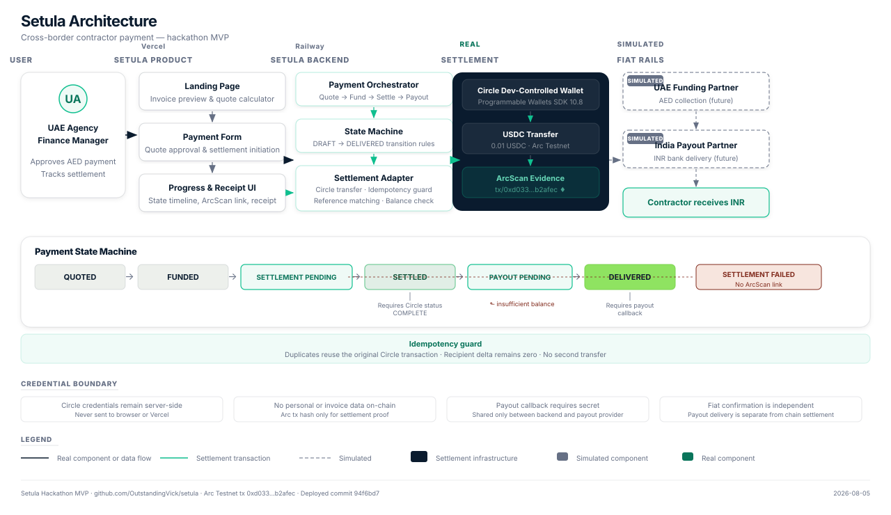

# Setula

Setula helps UAE agencies pay overseas contractors in local currency, with USDC settling on Arc under the hood.

- **Live demo**: https://setula-app.vercel.app
- **Repository**: https://github.com/OutstandingVick/setula
- **ArcScan proof**: https://testnet.arcscan.app/tx/0xd033f753ccae0b55585a94a754657a6154f2a6690748b55adbdbb469e2b2afec

## The problem

Cross-border contractor payments are fragile:

- The recipient cannot be certain what amount will arrive after FX and fees.
- Invoices and payment records live in separate systems.
- Payment stages are opaque — the sender does not know whether settlement completed, whether the payout reached the recipient, or where the failure occurred.
- Failures require manual investigation across payment partners, bank statements, and ledger entries.

## The solution

Setula turns a cross-border contractor payment into a single tracked journey:

```
AED quote → AED funding → USDC settlement on Arc → INR payout → invoice-linked receipt
```

The finance user sees only the AED amount they approve and the INR amount the contractor receives. USDC settlement is handled by the payment partner infrastructure — Circle wallets transfer value on Arc Testnet, and Setula surfaces the Arc transaction as machine-verifiable proof.

## Demo

### Live application

https://setula-app.vercel.app

### Steps

1. Open the demo. The landing page shows a contractor invoice for INR 91,000.
2. Click **Launch demo**. The payment page loads with a pre-filled AED 4,000 sandbox quote and the INR 91,000 invoice.
3. Click **Approve payment**. AED funding is simulated, then a real 0.01 USDC transfer executes on Arc Testnet.
4. Watch the progress bar advance through settlement. When it reaches `SETTLED`, an ArcScan link appears.
5. Click the ArcScan link to view the confirmed transaction on Arc Testnet.
6. Back in the demo, click **Confirm delivery**. INR payout is simulated and the payment reaches `DELIVERED`.
7. The receipt page shows the payment reference, settlement amount, ArcScan link, and received amount — all linked to the original invoice.

### Expected payment states

```
DRAFT → QUOTED → FUNDED → SETTLEMENT_PENDING → SETTLED → PAYOUT_PENDING → DELIVERED
```

## What is real and simulated

| Component | Hackathon status |
|---|---|
| Quote generation | Sandbox (fixed 22.75 INR/AED rate) |
| AED collection | Simulated |
| Circle wallet settlement | Real |
| USDC transfer on Arc Testnet | Real |
| Arc transaction proof | Real |
| INR bank payout | Simulated |
| Invoice and receipt reconciliation | Real application logic |

## Why Arc

Setula uses Arc for the settlement leg because Arc provides:

- USDC settlement — a stable, widely-supported digital dollar.
- Deterministic transaction confirmation — the settlement outcome is unambiguous.
- Predictable USDC-denominated execution cost — no surprise fees during transfer.
- Machine-verifiable settlement evidence — every transfer produces a transaction hash retrievable on ArcScan.
- Reconciliation through transaction hashes — the hash uniquely links the payment record to the on-chain settlement.

Arc does not perform AED collection or INR delivery. Setula handles those legs through simulated funding and payout in this prototype.

## Core features

- Recipient-fixed quote — the contractor sees the exact INR amount before approval.
- Invoice-linked payment — every payment is bound to a specific invoice.
- Real Arc Testnet settlement — a live USDC transfer confirms the payment on-chain.
- Separate settlement and payout states — settlement completion and payout delivery are tracked independently.
- Duplicate-transfer prevention — repeated settlement submissions reuse the original transaction.
- Insufficient-balance failure handling — underfunded wallets produce a clear failure state with no settlement link.
- Invoice-linked receipt — the receipt references the invoice, payment, and Arc transaction.
- ArcScan evidence — every settled payment includes a link to the public Arc testnet explorer.
- Responsive landing page and payment flow — the UI works from 320 px through 1440 px.

## Architecture

```
Browser ──→ Vercel (Next.js landing page)
              │  /pay/*  ──→ Railway backend (Node.js HTTP server)
              │  /api/*  ──→ Railway backend
              │
              └── Next.js rewrites proxy to DEMO_BACKEND_ORIGIN
```

Text flow:

```
Next.js frontend → Setula backend → Circle Wallets → Arc Testnet → simulated payout provider
```

- **Frontend**: Next.js 16 on Vercel. The landing page and payment demo share a single origin through `rewrites()`. The browser never makes a cross-origin request.
- **Backend**: Raw `node:http` server on Railway. Serves static demo files and all API routes. Circle API calls and the payout callback secret are server-side only.
- **Persistence**: Atomic JSON file (`.setula-data.json`). Suitable for the demo; a durable database would replace it in production.
- **CORS**: The backend sets CORS headers for configured origins, but the Next.js proxy makes CORS unnecessary in the normal browser flow.

### Architecture diagram



## Technology stack

| Category | Technology |
|---|---|
| Language | TypeScript 7 |
| Runtime | Node.js 22 |
| Frontend framework | Next.js 16 (App Router, Turbopack) |
| Frontend UI | React 19, CSS |
| Icons | Lucide React |
| Backend HTTP | `node:http` (no framework) |
| Validation | Zod 4 |
| Build (browser bundle) | esbuild |
| Runtime (TypeScript) | tsx |
| Blockchain SDK | Circle Developer-Controlled Wallets 10.8 |
| Network | Arc Testnet |
| Settlement asset | USDC |
| Hosting (frontend) | Vercel |
| Hosting (backend) | Railway |
| Testing | Vitest 4 |
| Linting | `tsc --noEmit` |

## Local setup

### Requirements

- Node.js 22 or newer
- Circle test API key and entity secret
- Two funded developer-controlled wallet IDs and addresses on `ARC-TESTNET`

### Install

```sh
git clone https://github.com/OutstandingVick/setula.git
cd setula
npm install
```

### Configure

Copy `.env.example` to `.env` and populate:

```
CIRCLE_API_KEY=
CIRCLE_ENTITY_SECRET=
CIRCLE_WALLET_A_ID=
CIRCLE_WALLET_A_ADDRESS=
CIRCLE_WALLET_B_ID=
CIRCLE_WALLET_B_ADDRESS=
CIRCLE_BLOCKCHAIN=ARC-TESTNET
CIRCLE_USDC_TOKEN_ID=
PAYOUT_CALLBACK_SECRET=
```

Optional controls:

```
HOST=0.0.0.0
PORT=4000
DATA_FILE=.setula-data.json
POLL_INTERVAL_MS=2000
POLL_TIMEOUT_MS=180000
```

Never commit `.env`.

### Backend development server

```sh
npm run dev
```

Opens `http://localhost:4000/pay`. The server binds to `0.0.0.0:4000` by default.

### Frontend development server

Keep the backend running, then in a second terminal:

```sh
npm run dev:landing
```

Opens `http://localhost:3001`. Set `DEMO_BACKEND_ORIGIN` if the backend is not at `http://127.0.0.1:4000`.

### Tests

```sh
npm test
```

16 tests covering the backend state machine, HTTP API, idempotency, failure paths, reference integrity, and landing-page quote utilities. Tests use an injected settlement gateway and never spend real USDC.

### TypeScript checks

```sh
npm run typecheck           # backend and shared types
npm run typecheck:landing   # landing page
```

### Production build

```sh
npm run build:landing   # Next.js landing page
npm run build:web       # browser bundle (esbuild)
```

### Golden-path verification

Runs a full end-to-end payment against a real Arc Testnet settlement:

```sh
npm run verify:golden-path
```

Set `VERIFY_BASE_URL` to target a deployed backend:

```sh
VERIFY_BASE_URL="https://ideal-alignment-production-912d.up.railway.app" npm run verify:golden-path
```

This creates a real USDC transfer, confirms the ArcScan link returns HTTP 200, validates duplicate prevention, and verifies the insufficient-balance failure path.

## API flow

Every `POST` requires an `Idempotency-Key` header. The payout callback also requires `X-Payout-Callback-Secret` matching `PAYOUT_CALLBACK_SECRET`.

| Method | Route | Purpose |
|---|---|---|
| `GET` | `/health` | Health check |
| `POST` | `/api/beneficiaries` | Create the India beneficiary |
| `POST` | `/api/invoices` | Create the INR invoice |
| `POST` | `/api/invoices/:invoiceId/quotes` | Generate the fixed sandbox AED/INR quote |
| `POST` | `/api/payments` | Create the payment intent in `QUOTED` |
| `POST` | `/api/payments/:paymentId/funding-confirmations` | Confirm simulated AED funding |
| `POST` | `/api/payments/:paymentId/settlements` | Execute the Arc USDC transfer |
| `POST` | `/api/payout-callbacks` | Simulate INR payout delivery or rejection |
| `POST` | `/api/payments/:paymentId/demo-payouts` | Server-side demo bridge to the simulated payout callback |
| `GET` | `/api/payments/:paymentId` | Read payment and linked objects with timeline |
| `GET` | `/api/receipts/:receiptId` | Read the invoice-linked receipt |

Amounts ending in `Minor` are integer minor units: paise for INR, fils for AED. The sandbox rate is fixed at 22.75 INR/AED. The demo invoice of INR 91,000 maps to a real 0.01 USDC Arc Testnet settlement.

## Safety and correctness

- **Idempotency protection**: every mutation endpoint requires a unique `Idempotency-Key` header. Repeating a request with the same key returns the original result. Duplicate settlement submissions reuse the existing Circle transaction and produce a recipient delta of zero.
- **Settlement verification**: a payment enters `SETTLED` only after Circle reports the transfer as `COMPLETE`. The transaction hash is recorded and surfaced as an ArcScan link.
- **Payout verification**: a payment enters `DELIVERED` only after the payout callback confirms delivery. The callback requires a secret shared only between the backend and the payout provider.
- **Failure isolation**: failed settlements record `SETTLEMENT_FAILED` with no transaction hash or ArcScan link. The payout callback is rejected for failed payments.
- **Reference integrity**: the invoice reference, payment reference, payout reference, and receipt reference all encode the same identifier. The receipt can be traced back to the invoice and the Arc transaction.
- **Server-side secrets**: Circle API keys, entity secrets, and the payout callback secret are never sent to the browser. The Vercel frontend receives only `DEMO_BACKEND_ORIGIN`.

## Validation evidence

| Check | Result |
|---|---|
| Five consecutive deployed runs | All passed: `DRAFT → DELIVERED` |
| Circle transaction status | `COMPLETE` |
| ArcScan HTTP status | 200 |
| Duplicate settlement protection | Passed (recipient delta 0) |
| Insufficient-balance failure | Passed (`SETTLEMENT_FAILED`, no ArcScan link) |
| Invalid payout callback | Rejected |
| Desktop QA (1440 px) | No overflow, values readable |
| Mobile QA (390 px) | No overflow, navigation adapted |
| Secret scan | Passed — no credentials in tracked files or browser assets |

Evidence transaction: [0xd033f753ccae0b55585a94a754657a6154f2a6690748b55adbdbb469e2b2afec](https://testnet.arcscan.app/tx/0xd033f753ccae0b55585a94a754657a6154f2a6690748b55adbdbb469e2b2afec)

Full deployment validation: [`STABLE_DEPLOYMENT_VALIDATION.md`](./STABLE_DEPLOYMENT_VALIDATION.md)

## Limitations and path to production

This is a hackathon prototype. Production readiness requires:

- Licensed UAE funding partner for AED collection.
- Licensed destination payout partner for INR delivery.
- Real FX liquidity and executable rates (replacing the sandbox quote).
- KYC / KYB and regulatory compliance controls.
- Legal approval in both jurisdictions.
- Production Arc settlement (mainnet, not testnet).
- Tested unit economics with sustainable margins.

The current deployment uses Railway's free tier with an ephemeral disk; the demo resets on each deploy. A persistent database and dedicated hosting plan would be required for any use beyond the demonstration.

## Repository structure

```
setula/
├── src/                    # Backend source
│   ├── server.ts           # Entry point — boots store, service, HTTP server
│   ├── http.ts             # Node.js HTTP server with all API routes
│   ├── service.ts          # Core business logic (SetulaService)
│   ├── domain.ts           # TypeScript types (Payment, Invoice, Quote, etc.)
│   ├── errors.ts           # Custom error classes
│   ├── state-machine.ts    # Payment status transition rules
│   ├── settlement.ts       # Settlement gateway interface
│   ├── store.ts            # In-memory and JSON-file persistence
│   └── arc/                # Circle + Arc integration
│       ├── config.ts       # Environment parsing for Circle credentials
│       ├── circle.ts       # Circle client factory and balance queries
│       ├── transfer.ts     # USDC transfer execution on Arc Testnet
│       └── amount.ts       # USDC parse and format utilities
├── web/                    # Browser SPA source
│   └── app.ts              # Payment demo client (vanilla TypeScript)
├── public/                 # Built browser assets (served by backend)
│   └── favicon.svg
├── landing/                # Next.js landing page
│   ├── app/                # App Router pages and layout
│   ├── components/         # React components (Hero, JourneySections, etc.)
│   ├── lib/                # Quote calculator utilities
│   └── public/             # Landing page static assets
├── tests/                  # Backend test suites
│   ├── service.test.ts     # State machine, idempotency, failure paths (9 tests)
│   └── http.test.ts        # HTTP server integration (2 tests)
├── scripts/
│   └── run-golden-path.ts  # End-to-end Arc Testnet verification
├── MVP_SCOPE.md            # Hackathon product boundary
├── STABLE_DEPLOYMENT_VALIDATION.md  # Deployed validation record
├── package.json
├── tsconfig.json
├── .env.example
└── .gitignore
```

## Licence

No licence is currently specified for this repository.
